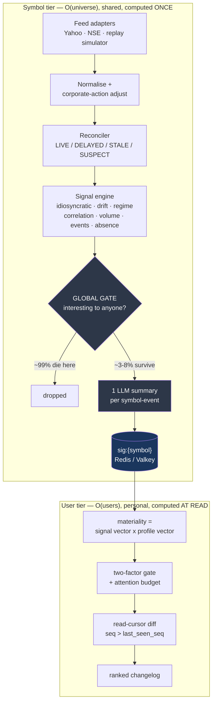

# Delta — a smart market watchlist

**CODE 2026 submission.** A watchlist that tells you what *meaningfully changed* since you
last looked, and nothing else.

> The core idea: **this is not a dashboard, it is a changelog with a read cursor.**
> Closer to a git diff or an email client than to a stock app. What you have already
> seen is marked read and never shown again.

Full reasoning, research basis and scaling analysis: **[DESIGN.md](DESIGN.md)**.

---

## The build we deliberately did not make

Watchlist CRUD -> live prices -> a "% since your last visit" banner -> LLM news summary cards
-> sparklines. That is what the prompt produces unassisted, and a panel will see it many times
over. Five things here are different:

1. **Personal materiality.** The same 4% move is front-page for one user and noise for another.
   Ranking is a function of position size, cost-basis proximity, list tenure, open frequency and
   your stated reason for watching.
2. **A watch thesis, and contradiction detection.** Adding a stock requires a plain-language
   reason. The system then surfaces evidence that **contradicts your own stated thesis** —
   *"you added this watching for margin recovery; margins fell 180bps."* Contradiction is worth
   more than confirmation, and nobody ships it because it is uncomfortable to receive.
3. **Signals no threshold alert can see.** Idiosyncratic move (beta stripped — most of a raw %
   move is just Nifty), slow drift (-8% over three weeks without one alertable day), volatility
   regime change, correlation break, and *absence* (expected to move on earnings day, didn't).
4. **An explicit attention budget.** At most N items per session, competing for slots. If
   everything is important, nothing is.
5. **Watchlist flow as first-party data.** Aggregate, k-anonymised net adds across users — the
   retail-attention analogue of the card-transaction panels institutions pay for, and
   structurally unavailable to anyone who is not a broker.

---

## What counts as "meaningful"

Measured in units of the symbol's own recent behaviour, never raw percent. A 3% move in a
stable large-cap is a 4-sigma event; in a smallcap it is Tuesday.

```
surprise = z(idiosyncratic return | trailing 60d realised vol)
         + volume participation z
         + P(changepoint | BOCPD)
         + discrete event prior

promote  iff >= 2 independent confirming factors     <- the two-factor rule

attention = surprise x relevance(user, symbol) x thesis_impact x (1 - recency_penalty)
```

The two-factor gate is not a heuristic we invented: alert-fatigue research finds
single-factor alerts run ~45% false positives against under 20% for multi-factor ones, and
that traders drowning in unfiltered alerts make measurably worse decisions.

---

## Architecture

The load-bearing insight: 10,000 users x 50 symbols = 500,000 user-symbol pairs, but the
liquid universe is only ~2,000 symbols. So the pipeline splits at the symbol/user boundary.



Everything expensive happens once per **symbol**. Everything personal is arithmetic over two
vectors at **read** time. Consequences:

- **Marginal LLM cost per additional user: zero.** One summary serves every subscriber.
- **Nothing expensive is ever in the request path** — a request is a join of precomputed
  vectors. p95 target < 200ms, and the same architecture serves 10k or 10M.
- The ingest tier is **O(universe), not O(users)** — 10x the users adds zero load to it.

At 10,000 users we shard nothing: one Postgres, one Redis, one ingest worker, one scoring
worker. The schema carries the shard key and every query is user-scoped, so there are zero
cross-shard reads when it does need splitting. **10,000 users is not a throughput problem**
(~400 msg/s ingest, ~50 rps peak read) — it is a fan-out and cost problem, and we solve
exactly those.

---

## The free tier is the proof, not a compromise

The prototype runs its entire AI layer on free tiers (Gemini -> OpenRouter -> a deterministic
template floor). That ceiling is roughly 1,500 requests/day, which makes it the most honest
possible test of the architecture:

| Design | LLM calls/day at 10k users | Fits a free tier? |
|---|---|---|
| Naive — summarise per user, per view | ~200,000 | **No — ~400x over** |
| Ours — per symbol-event, shared | ~800 | **Yes, with room** |

The naive design cannot be demonstrated at all at this scale. **The app also runs with no API
keys whatsoever** — the template provider composes a factual summary from signal evidence, so
a reviewer who clones and configures nothing still sees a complete product.

---

## How the brief's six decisions were answered

| The brief asks | Our answer | Where |
|---|---|---|
| What counts as a meaningful change | Surprise in sigma of the symbol's own vol, gated on >= 2 confirming factors, then scored per user | `backend/signals/`, `backend/scoring/` · [DESIGN.md §3](DESIGN.md) |
| What information to surface | A ranked changelog under an attention budget, every claim evidence-linked; plus a *quiet* list, because "nothing changed" is a real answer | `contracts/API.md` · [§2](DESIGN.md) |
| How state persists across sessions/devices | Monotonic `seq` + per-user-per-symbol `last_seen_seq`; cross-device merge is `max()` — idempotent, commutative, no coordination | `backend/state/` · [§4](DESIGN.md) |
| Stale, delayed or conflicting data | Freshness state machine on every number; sources disagreeing beyond tolerance mark `SUSPECT` and **suppress** the derived signal; corporate actions adjusted *before* detection; corrections are append-only and always surfaced | `backend/ingest/reconciler.py` · [§8](DESIGN.md) |
| How it scales | Split at the symbol/user boundary; fan-out-on-read for ranking, fan-out-on-write only for the rare top tier; thesis clustering keeps contradiction detection O(events x beliefs), not O(users) | [§5](DESIGN.md), [§7](DESIGN.md) |
| Where to keep it simple | No streaming ticks by default, no microservice sprawl, no custom ML, and **no recommendation engine, ever** | [§9](DESIGN.md) |

---

## Deliberate non-features

No flashing red/green tape. No push-on-tick. No buy/sell language, price targets or
recommendations anywhere — every claim traces to a dated, sourced piece of evidence.

That last one is a design constraint turned into the differentiator: SEBI moved from advisory
to enforcement on digital investment advice in 2026, so a product that *only* reports what
changed, with full provenance, is both the compliant answer and the more useful one.

---

## Repo layout

```
DESIGN.md              full system design, research basis, scaling analysis
contracts/             the authoritative boundary between the two halves
  API.md               endpoints, read-cursor semantics, degradation rules
  types.ts             shared types; backend mirrors these as Pydantic models
  fixtures/            golden JSON — frontend builds against these
backend/               FastAPI · ingest · signal engine · scoring · LLM router
frontend/              React 19 · Vite · Oat CSS · Motion
```

Backend and frontend were built in parallel against `contracts/`, which is why the fixtures
exist: they are the meeting point that let both halves be written at once without drift.

## Running it

See `backend/README.md` and `frontend/README.md`.
