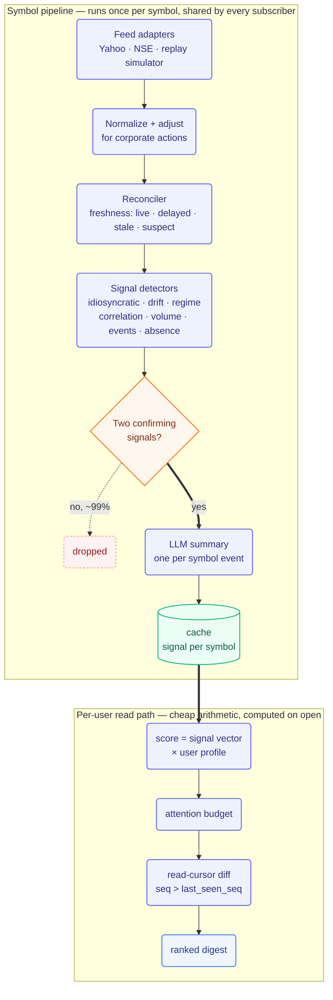

# Delta — Smart Market Watchlist

A watchlist that reports what changed since you last checked, and nothing else. Built for
CODE 2026.

Design writeup, research basis, and scaling analysis: [DESIGN.md](DESIGN.md).

Live demo: frontend at `frontend-eight-livid-35.vercel.app`, backend at
`delta-watchlist-backend.onrender.com/api/v1`. The backend runs on a free-tier host that
sleeps after a period of inactivity — if the first load takes up to a minute, that's it
waking up, not a bug.

## Contents

- [Overview](#overview)
- [Features](#features)
- [Architecture](#architecture)
- [Tech stack](#tech-stack)
- [Getting started](#getting-started)
- [Project structure](#project-structure)
- [API](#api)
- [Design notes](#design-notes)

## Overview

Most watchlist apps converge on the same shape: add a symbol, show a live price, show a
percentage change since you last opened the app. Delta is built around a different idea —
the watchlist behaves like a changelog. Once you've read something, it's marked read and
does not resurface.

Three decisions follow from that:

- Every signal is scored against the symbol's own recent behavior, in standard deviations,
  not raw percent change. A 3% move means something different for a stable large-cap than
  for a small-cap.
- A change is only surfaced once two independent signals confirm it. A single moving metric
  is not enough on its own.
- Each LLM summary is generated once per symbol event and shared across every subscriber to
  that symbol, rather than regenerated per user per view. This is what keeps the AI layer
  inside free-tier rate limits at 10,000 users — see [Architecture](#architecture).

## Features

| Feature | Description |
|---|---|
| Personal materiality | Ranking factors in position size, cost-basis proximity, watch tenure, and open frequency, so the same move can rank differently for two different users. |
| Thesis and contradiction detection | Adding a symbol requires a plain-language reason for watching it. Delta later checks new evidence against that stated reason, and flags when the evidence points the other way. |
| Signals beyond threshold alerts | Idiosyncratic move (beta-stripped), slow drift, volatility regime change, correlation break, and absence (an event was expected to move the price and didn't). |
| Attention budget | A fixed number of ranked slots per session. Anything cut from the ranking is reported as suppressed, not hidden. |
| Watchlist flow signal | Aggregate, k-anonymized net add/remove activity across users, gated behind a minimum cohort size. |
| Zero-config operation | Runs with no Postgres, no Redis, and no LLM API key. Every external dependency has a deterministic fallback. |

### Definition of "meaningful"

```
surprise = z(idiosyncratic return | trailing 60d realised vol)
         + volume participation z
         + P(changepoint | BOCPD)
         + discrete event prior

promote  iff >= 2 independent confirming factors

attention = surprise x relevance(user, symbol) x thesis_impact x (1 - recency_penalty)
```

## Architecture

At 10,000 users watching ~50 symbols each, that's 500,000 user-symbol pairs, but the liquid
universe is only around 2,000 symbols. The pipeline is split at that boundary: work that
depends only on the symbol runs once and is shared; work that depends on the user runs at
read time, over precomputed data.



This split has a few consequences:

- The marginal LLM cost of an additional user is zero, since one summary is shared by every
  subscriber to that symbol.
- Nothing expensive runs in the request path — a request reads precomputed vectors and joins
  them. Target p95 is under 200ms, and that target doesn't change between 10,000 and 10
  million users, because the request-path work doesn't grow with the universe size.
- Ingest work scales with the number of symbols, not the number of users, so a 10x increase
  in users adds no load to the ingest or scoring tiers.

At the current scale nothing is sharded — one database, one cache, one ingest worker. The
schema carries a shard key and every read is scoped to a single user, so splitting later is
a deployment change rather than a schema migration.

### Why free-tier LLMs

| Approach | LLM calls/day at 10,000 users | Fits a free tier |
|---|---|---|
| Summarize per user, per view | ~200,000 | No — roughly 400x over |
| Summarize once per symbol event, shared | ~800 | Yes |

The app runs its AI layer entirely on free tiers, cascading through Gemini, then
OpenRouter, then NVIDIA NIM, and finally a deterministic template that composes a summary
directly from the underlying signal evidence. It runs correctly with no LLM key configured
at all — the naive per-view design couldn't fit in this budget regardless of provider, which
is closer to a proof of the architecture than a cost optimization.

## Tech stack

| Layer | Technology |
|---|---|
| Backend | Python, FastAPI, SQLAlchemy (async), SQLite/Postgres, Redis with an in-process fallback |
| Frontend | React 19, Vite, TypeScript, Tailwind CSS |
| LLM providers | Gemini, OpenRouter, NVIDIA NIM (free tiers), deterministic template fallback |
| Data | Deterministic seeded replay simulator, Yahoo Finance adapter |

## Getting started

Requires Python 3.11+ and Node 18+.

### Backend

```bash
cd backend
python -m venv .venv
source .venv/bin/activate      # .venv\Scripts\activate on Windows
pip install -r requirements.txt
uvicorn app.main:app --reload --port 8000
```

No `.env` file is required. Without one, the app runs on SQLite with an in-process cache
and the deterministic template summarizer. See [backend/README.md](backend/README.md) for
optional Postgres, Redis, and LLM provider configuration.

### Frontend

```bash
cd frontend
npm install
npm run dev
```

Open `http://localhost:5173`. See [frontend/README.md](frontend/README.md) for build and
environment variable details.

## Project structure

```
DESIGN.md              system design, research basis, scaling analysis
contracts/             shared contract between backend and frontend
  API.md               endpoints, read-cursor semantics, degradation rules
  types.ts             shared types, mirrored by backend Pydantic models
  fixtures/             sample JSON responses used in frontend development
backend/                FastAPI app: ingest, signal detectors, scoring, LLM router
frontend/               React app
```

Backend and frontend were developed against `contracts/` in parallel; the fixtures are what
made that possible without the two sides drifting apart.

## API

Full endpoint reference, read-cursor semantics, and degradation rules:
[contracts/API.md](contracts/API.md).

| Open question from the brief | How it's answered | Reference |
|---|---|---|
| What counts as a meaningful change | Deviation from the symbol's own volatility, gated on two or more confirming signals, then re-ranked per user | `backend/signals/`, `backend/scoring/`, [DESIGN.md §3](DESIGN.md) |
| What information to surface | A ranked digest under a fixed attention budget, every claim linked to evidence, plus a list of symbols checked and found unchanged | `contracts/API.md`, [DESIGN.md §2](DESIGN.md) |
| State across sessions and devices | A monotonic sequence number and a per-user, per-symbol read cursor; cross-device sync is a max() merge | `backend/state/`, [DESIGN.md §4](DESIGN.md) |
| Stale, delayed, or conflicting data | A freshness state on every value; disagreeing sources are marked suspect and their derived signals suppressed; corporate actions are adjusted before signal detection; corrections are appended, not overwritten | `backend/ingest/reconciler.py`, [DESIGN.md §8](DESIGN.md) |
| Scaling | Split at the symbol/user boundary described above; belief clustering keeps contradiction detection proportional to distinct beliefs rather than user count | [DESIGN.md §5](DESIGN.md), [§7](DESIGN.md) |
| Where to keep it simple | No streaming price ticks by default, no service sprawl, no custom ML training, no recommendation engine | [DESIGN.md §9](DESIGN.md) |

## Design notes

- No advisory language anywhere in the product. No buy/sell signals, no price targets, no
  recommendations — every claim traces back to a dated, sourced piece of evidence.
- No push-on-tick, no flashing price ticker. SEBI's 2026 shift toward stricter enforcement
  on digital investment advice made "report what changed, with full provenance" both the
  safer and the more useful design.

Full reasoning and citations: [DESIGN.md](DESIGN.md).
