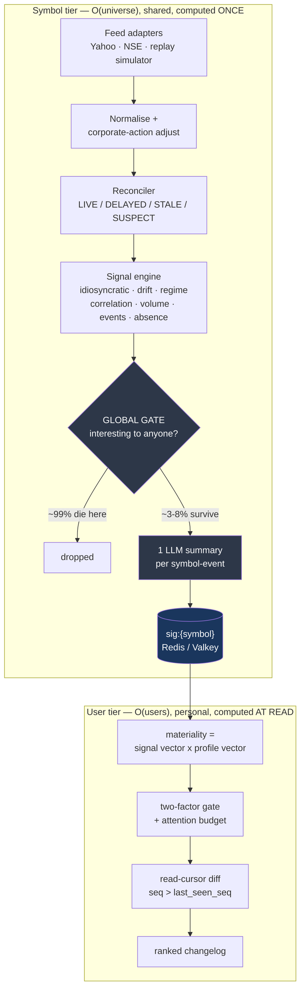

# Delta — Smart Market Watchlist

A watchlist that reports what *meaningfully changed* since you last checked — nothing else.

**CODE 2026 submission.** Full design writeup, research citations, and scaling analysis: [DESIGN.md](DESIGN.md).

> Delta is not a dashboard. It's a changelog with a read cursor — closer to a git diff or an
> email inbox than to a stock-price app. Once you've seen something, it's marked read and
> never shown again.

---

## Table of Contents

- [Overview](#overview)
- [Key Features](#key-features)
- [Architecture](#architecture)
- [Tech Stack](#tech-stack)
- [Getting Started](#getting-started)
- [Project Structure](#project-structure)
- [API](#api)
- [Design Rationale](#design-rationale)
- [License](#license)

---

## Overview

Most "smart watchlist" builds converge on the same shape: watchlist CRUD, live prices, a
"% since your last visit" banner, LLM-generated news cards, sparklines. Delta deliberately
does not build that. Instead:

- Every signal is scored **relative to the symbol's own recent behavior**, in units of
  standard deviation — not raw percent change.
- A change is only surfaced once **two independent, uncorrelated signals** confirm it (the
  "two-factor gate"), which research shows cuts alert false-positive rates from ~45% to
  under 20%.
- Every LLM summary is generated **once per symbol-event and shared across every subscriber**,
  not regenerated per user per view — the architectural decision that keeps the entire AI
  layer inside a free tier at 10,000 users.

## Key Features

| Feature | What it does |
|---|---|
| **Personal materiality** | Ranks changes by position size, cost-basis proximity, watch tenure, and open frequency — the same 4% move can be front-page for one user and noise for another. |
| **Thesis + contradiction detection** | Adding a symbol requires a plain-language reason. Delta later surfaces evidence that *contradicts* that stated thesis, not just evidence that confirms it. |
| **Signals no threshold alert catches** | Idiosyncratic move (beta-stripped), slow drift, volatility regime change, correlation break, and *absence* (expected to move on an event, didn't). |
| **Explicit attention budget** | A fixed number of slots per session, ranked and competed for. Suppressed items are reported, not hidden. |
| **Watchlist flow as first-party data** | Aggregate, k-anonymized net-add/remove flow across users — the retail-attention analogue of institutional card-transaction data. |
| **Zero-config, zero-key operation** | Runs end-to-end with no Postgres, no Redis, and no LLM API keys. Every dependency degrades to a deterministic fallback. |

### What counts as "meaningful"

Scored in units of the symbol's own recent behavior, never raw percent — a 3% move in a
stable large-cap is a 4-sigma event; in a small-cap, it's routine.

```
surprise = z(idiosyncratic return | trailing 60d realised vol)
         + volume participation z
         + P(changepoint | BOCPD)
         + discrete event prior

promote  iff >= 2 independent confirming factors     # the two-factor rule

attention = surprise x relevance(user, symbol) x thesis_impact x (1 - recency_penalty)
```

## Architecture

The load-bearing constraint: 10,000 users × 50 symbols = 500,000 user-symbol pairs, but the
liquid universe is only ~2,000 symbols. The pipeline splits at the symbol/user boundary so
that everything expensive runs once per **symbol**, and everything personal is cheap
arithmetic computed at **read** time.



**Consequences of this split:**

- Marginal LLM cost per additional user is **zero** — one summary serves every subscriber.
- Nothing expensive runs in the request path; a request is a join over precomputed vectors.
  Target p95 < 200ms, at 10k or 10M users, on the same architecture.
- The ingest tier is O(universe), not O(users) — a 10x increase in users adds zero load to it.

At 10,000 users the deployment shards nothing (one Postgres, one Redis, one ingest worker,
one scoring worker), but the schema already carries the shard key and every query is
user-scoped, so scaling out is a configuration change, not a migration.

### The free tier as a correctness proof

| Design | LLM calls/day at 10k users | Fits a free tier? |
|---|---|---|
| Naive — summarize per user, per view | ~200,000 | No — ~400x over |
| Delta — per symbol-event, shared | ~800 | Yes, with room |

The app runs its entire AI layer on free-tier providers (cascading through Gemini →
OpenRouter → NVIDIA NIM → a deterministic template floor) and still works correctly with
**no API keys configured at all** — the template provider composes a factual summary
directly from signal evidence.

## Tech Stack

| Layer | Technology |
|---|---|
| Backend | Python · FastAPI · SQLAlchemy (async) · Postgres/SQLite · Redis/in-process fallback |
| Frontend | React 19 · Vite · TypeScript · Tailwind CSS |
| LLM providers | Gemini · OpenRouter · NVIDIA NIM (free tiers) · deterministic template floor |
| Data | Deterministic seeded replay simulator + Yahoo Finance adapter |

## Getting Started

### Prerequisites

- Python 3.11+
- Node.js 18+

### Backend

```bash
cd backend
python -m venv .venv
.venv/Scripts/activate        # .venv/bin/activate on macOS/Linux
pip install -r requirements.txt
uvicorn app.main:app --reload --port 8000
```

No `.env` file is required — the app boots on SQLite with an in-process cache and a
deterministic template summarizer. See [`backend/README.md`](backend/README.md) for optional
configuration (Postgres, Redis, LLM provider keys).

### Frontend

```bash
cd frontend
npm install
npm run dev
```

Open `http://localhost:5173`. See [`frontend/README.md`](frontend/README.md) for build and
environment details.

## Project Structure

```
DESIGN.md              full system design, research basis, scaling analysis
contracts/             the authoritative boundary between backend and frontend
  API.md               endpoints, read-cursor semantics, degradation rules
  types.ts              shared types; backend mirrors these as Pydantic models
  fixtures/             golden JSON — frontend builds against these
backend/                FastAPI · ingest · signal engine · scoring · LLM router
frontend/               React 19 · Vite · Tailwind CSS
```

Backend and frontend were built in parallel against `contracts/`; the fixtures are the
meeting point that let both sides be developed simultaneously without drift.

## API

Full endpoint reference, read-cursor semantics, and degradation rules: [`contracts/API.md`](contracts/API.md).

| How the brief's decisions are answered | Implementation | Reference |
|---|---|---|
| What counts as a meaningful change | Surprise in sigma of the symbol's own volatility, gated on ≥2 confirming factors, then scored per user | `backend/signals/`, `backend/scoring/` · [DESIGN.md §3](DESIGN.md) |
| What information to surface | A ranked changelog under an attention budget, every claim evidence-linked, plus a *quiet* list for symbols checked and found unchanged | `contracts/API.md` · [DESIGN.md §2](DESIGN.md) |
| State across sessions/devices | Monotonic `seq` + per-user-per-symbol `last_seen_seq`; cross-device merge via `max()` — idempotent, commutative, no coordination | `backend/state/` · [DESIGN.md §4](DESIGN.md) |
| Stale, delayed, or conflicting data | Freshness state machine on every value; disagreeing sources mark `SUSPECT` and suppress the derived signal; corporate actions adjusted before detection; corrections are append-only | `backend/ingest/reconciler.py` · [DESIGN.md §8](DESIGN.md) |
| Scaling | Split at the symbol/user boundary; fan-out-on-read for ranking; thesis clustering keeps contradiction detection O(events × beliefs), not O(users) | [DESIGN.md §5](DESIGN.md), [§7](DESIGN.md) |
| Where to keep it simple | No streaming ticks by default, no microservice sprawl, no custom ML, no recommendation engine | [DESIGN.md §9](DESIGN.md) |

## Design Rationale

Compliance and product-design constraints, by design:

- **No advisory language anywhere.** No buy/sell signals, no price targets, no
  recommendations — every claim traces to a dated, sourced piece of evidence.
- **No push-on-tick, no flashing UI.** SEBI's 2026 shift from advisory to enforcement on
  digital investment advice made "report what changed, with full provenance" both the
  compliant answer and the more useful product.

For the full reasoning, research citations, and scaling analysis, see [DESIGN.md](DESIGN.md).

## License

Not currently licensed for reuse. Built for CODE 2026.
